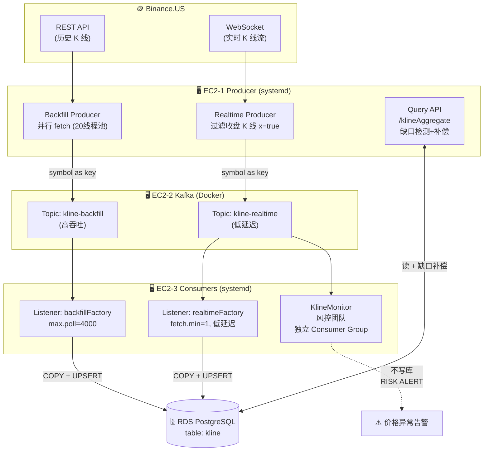
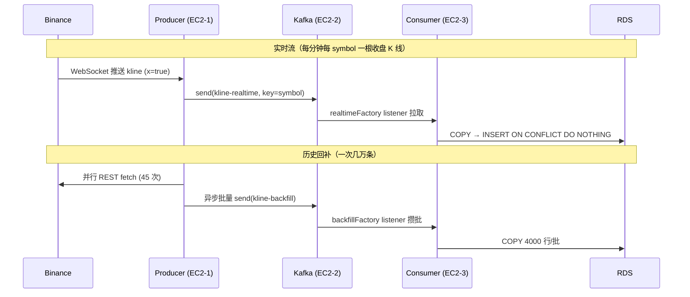
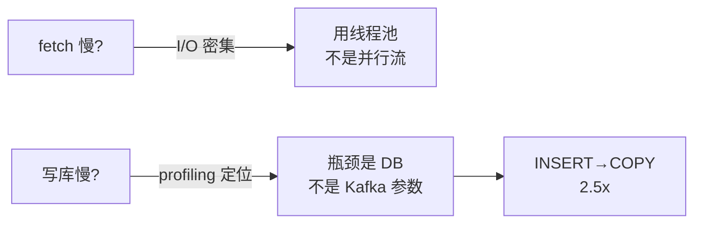
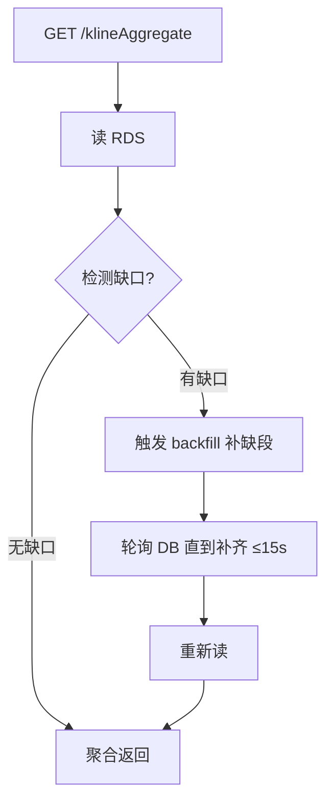
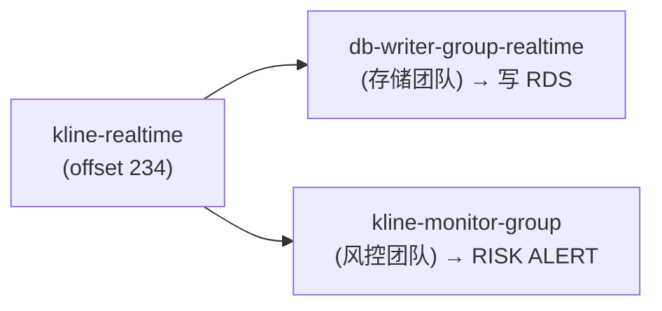

# KlineDataPipeline — 分布式加密货币 K 线数据管道

> 一个基于 **Spring Boot + Kafka + PostgreSQL** 的加密货币 K 线（OHLCV）数据采集、传输、存储与查询系统，部署在 **AWS（3×EC2 + RDS）**。
> 同时支持**历史回补（Backfill）**与**实时接入（Realtime）**两条数据流，通过 Kafka 双 Topic 解耦，并演示了 **Kafka 多 Consumer Group 扇出**（多团队独立消费同一份数据）。

---

## ✨ 核心特性

| 特性 | 说明 |
|------|------|
| 🔄 **双数据流** | Backfill（REST 拉历史）+ Realtime（WebSocket 接实时），UPSERT 自动去重 |
| 🚦 **双 Topic 隔离** | `kline-backfill`（吞吐型）+ `kline-realtime`（延迟型），互不干扰 |
| 🧵 **双 Listener** | Consumer 两个独立线程，realtime 低延迟 / backfill 高吞吐，各自调优 |
| 🔁 **幂等写入** | `INSERT ON CONFLICT DO NOTHING`，重投/重叠零重复 |
| 🩹 **缺口自动补偿** | 查询时检测数据缺口 → 自动 backfill 补齐 → 再返回完整结果 |
| 📡 **多团队扇出** | 风控监控团队用独立 Consumer Group 消费同一份数据，零改动现有服务 |
| ⚡ **性能优化** | 端到端 1 个月数据 11s → 3s（详见 [性能优化](#-性能优化实测)）|
| 🛡️ **systemd 守护** | 3 个服务进程化，崩溃自启，密码隔离到 env 文件 |

---

## 🏗️ 系统架构



---

## 🔀 数据流：一根 K 线的旅程



---

## 📦 项目结构

```
KlineDataPipeline/
├── KlineLoaderProject/        # Producer：Backfill + Realtime + Query
│   └── src/main/java/com/example/demo/
│       ├── controller/        # KlineLoadController(写) / KlineAggregateController(查)
│       ├── service/
│       │   ├── LoadService            # 并行 fetch 编排
│       │   ├── BinanceAPIService      # REST 调用 + 并行解析
│       │   ├── BinanceRealtimeProducer# ⭐ WebSocket 实时订阅 + 重连
│       │   ├── KlineProducer          # ⭐ 双 topic 发送
│       │   ├── KlineAggregateService  # ⭐ 聚合 + 缺口自动补偿
│       │   └── ValidationService      # symbol 白名单校验
│       ├── repo/KlineMapper           # MyBatis（查询 ORDER BY）
│       └── config/LogAspect           # AOP 日志
│
├── KlineConsumerProject/      # Consumer：写库
│   └── src/main/java/com/example/consumer/
│       ├── config/KafkaConfig         # ⭐ 双 Factory（延迟型/吞吐型）
│       ├── service/KlineConsumer      # ⭐ 双 Listener
│       └── repo/
│           ├── KlineCopyWriter        # ⭐ PostgreSQL COPY 写入
│           └── KlineMapper            # batchInsert + UPSERT
│
├── KlineMonitorProject/       # ⭐ 风控监控团队（独立 Consumer Group）
│   └── src/main/java/com/example/monitor/
│       └── service/KlineMonitor       # 实时价格异常检测，不写库
│
├── deploy/                    # systemd service 文件 ×3
├── PROJECT_SNAPSHOT.md        # 完整架构文档（含 AWS 基础设施清单）
└── EXPERIMENTS.md             # 性能实验报告（5 个实验 + 数据）
```

---

## ⚡ 性能优化（实测）

> 测试数据集：BTCUSDT 1 个月 1 分钟 K 线 = **44,640 条**（Binance 单次上限 1000，需 45 次调用）

| 阶段 | 优化前 | 优化后 | 手段 |
|------|--------|--------|------|
| Binance fetch | 1736ms | **315ms** | 串行 → 自定义 20 线程池（**5.5x**）|
| Kafka 发送 | 1700ms | **300ms** | 串行 → `CompletableFuture` 异步并行（**5x**）|
| Consumer 写库 | 5000ms | **2000ms** | INSERT → PostgreSQL **COPY**（**2.5x**）|
| flush 等待 | 5000ms | **0ms** | scheduler → Batch Listener 自然攒批 |
| **端到端** | **~11s** | **~3s** | — |

### 关键洞察



- **并行流陷阱**：`IntStream.parallel()` 按 CPU 核数定并行度，在 1 vCPU 上退化为串行；而 fetch 是 I/O 密集（90% 时间等网络），应该用线程池开 20 个线程。
- **找对瓶颈**：扫描 `max.poll.records`（250→7000）只换来 21% 提升 → 真瓶颈是 RDS 写入能力。改用 COPY 才是正解（2.5x）。
- **COPY 保幂等**：COPY 不支持 `ON CONFLICT`，所以先 COPY 到临时表，再 `INSERT...SELECT...ON CONFLICT` 转入主表。

详见 [EXPERIMENTS.md](./EXPERIMENTS.md)。

---

## 🩹 查询缺口自动补偿（亮点设计）



如果 realtime 漏采了某些分钟，查询时自动触发 backfill 补齐，**永不返回带缺口的错误聚合**。实测删除中间一条数据后查询，**1.8 秒自动补回**。

---

## 📡 Kafka 多 Consumer Group 扇出

一份 `kline-realtime` 数据，被两个独立 Consumer Group 消费，各自维护 offset，互不影响：



**加监控团队零改动现有写库服务** —— 这是 Kafka 相比共享数据库 / HTTP 推送的核心优势：生产者不知道也不关心有哪些消费者。

实测风控告警输出：
```
SOLUSDT ⚠️ RISK ALERT（1 分钟波动超 0.1% 阈值）
BTCUSDT ok (0.068%) / ETHUSDT ok (0.079%)
```

---

## 🛠️ 技术栈

`Java 17` · `Spring Boot 3.5` · `Spring Kafka` · `Spring WebSocket` · `MyBatis` · `PostgreSQL` · `Apache Kafka` · `Docker` · `AWS (EC2 / RDS)` · `systemd`

---

## 🚀 部署

### AWS 基础设施
- **EC2-1**（Producer）：Java + Maven，跑 backfill + realtime + query
- **EC2-2**（Kafka）：Docker 跑 Kafka + Zookeeper
- **EC2-3**（Consumer）：Java，跑写库 Consumer + 监控 Consumer
- **RDS**：PostgreSQL（db.t3.micro，免费层）
- **Security Group**：最小权限（SSH→My IP，Kafka/RDS 端口只对内部 SG 开放）

### 启动（systemd）
```bash
# EC2-1
sudo systemctl start kline-producer
# EC2-3
sudo systemctl start kline-consumer
sudo systemctl start kline-monitor
# EC2-2
cd ~/kafka && docker-compose up -d
```

### 表结构
```sql
CREATE TABLE kline (
    symbol      VARCHAR(20)      NOT NULL,
    open_time   BIGINT           NOT NULL,
    close_time  BIGINT           NOT NULL,
    open        DOUBLE PRECISION NOT NULL,
    high        DOUBLE PRECISION NOT NULL,
    low         DOUBLE PRECISION NOT NULL,
    close       DOUBLE PRECISION NOT NULL,
    volume      DOUBLE PRECISION NOT NULL,
    PRIMARY KEY (symbol, open_time, close_time)
);
```

---

## 📡 API

| 接口 | 方法 | 说明 |
|------|------|------|
| `/klineloader` | POST | 触发 backfill。参数：`symbol, startTime, endTime, limit, mode(serial/parallel/pool)` |
| `/klineAggregate` | GET | 多周期聚合查询。参数：`symbol, interval(5m/1h/1d), startTime, endTime`，自动补缺口 |

---

## ✅ 数据正确性（全部实测验证）

| 验证 | 结果 |
|------|------|
| realtime + backfill 重叠 | 0 重复行（UPSERT skipped）|
| 时间连续性 | 0 缺口（相邻 = 60000ms）|
| OHLCV 合理性 | 0 异常（high≥low, close∈[low,high]）|
| volume 体积守恒 | 各 interval 聚合总量一致 |
| 缺口补偿 | 删 1 条 → 1.8s 自动补回 |
| 多 group 独立消费 | monitor / writer 各自 offset |

---

## 📚 文档

- [PROJECT_SNAPSHOT.md](./PROJECT_SNAPSHOT.md) — 完整架构、AWS 清单、配置、部署细节
- [EXPERIMENTS.md](./EXPERIMENTS.md) — 5 个性能实验的数据与结论

---

## 📈 后续可优化方向

- Kafka RF=1→3 + 多 partition（消除单点故障 + 水平扩展）
- 查询接口改 202 异步返回 + gap-fill 异步化（避免阻塞线程）
- 集成测试（Testcontainers）、CI/CD（GitHub Actions）
- 密码迁移到 AWS Secrets Manager

---

*本项目用于学习分布式数据管道设计，演示了生产者/消费者解耦、双流协作、故障隔离、性能优化与多团队数据扇出等工程实践。*
