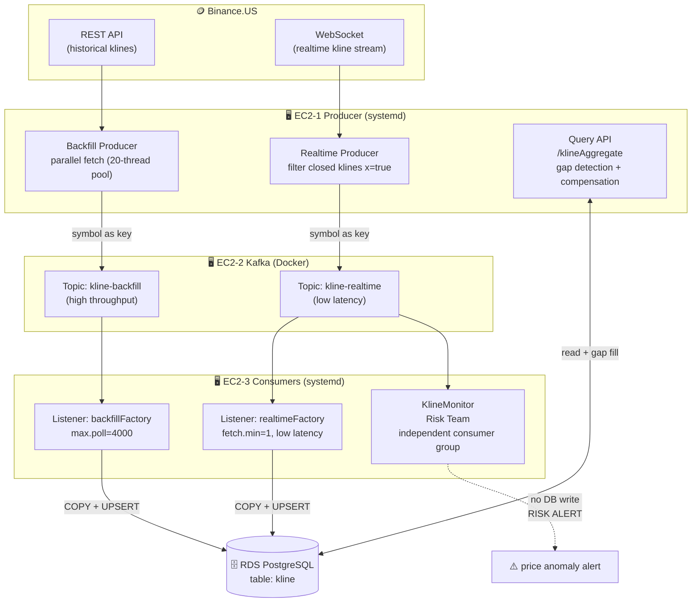
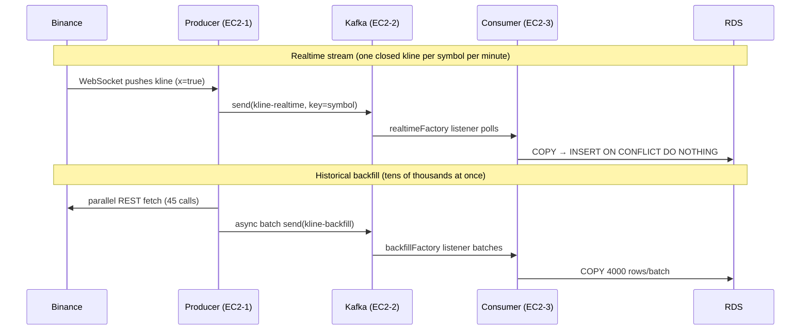
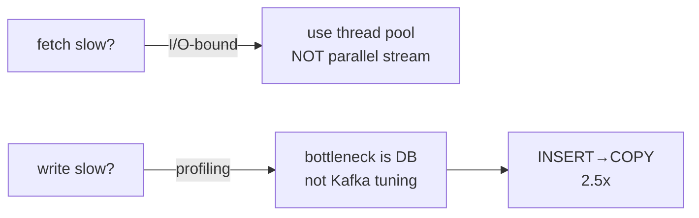
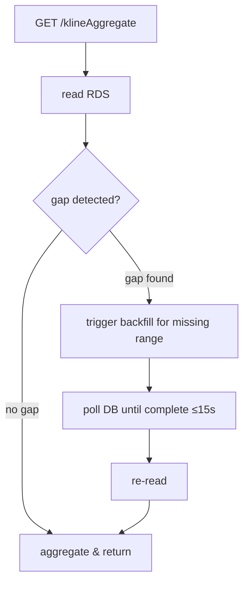
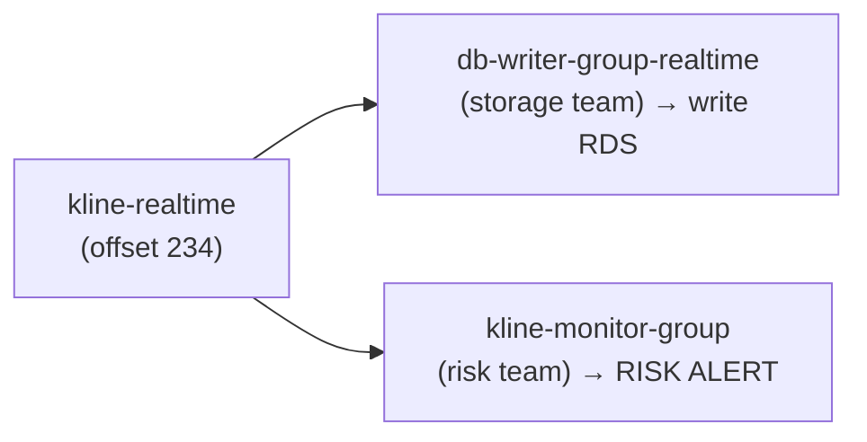

# KlineDataPipeline — Distributed Crypto K-Line Data Pipeline

> A crypto K-line (OHLCV) ingestion, streaming, storage, and query system built with **Spring Boot + Kafka + PostgreSQL**, deployed on **AWS (3×EC2 + RDS)**.
> It supports two coordinated data flows — **historical backfill** and **realtime streaming** — decoupled via dual Kafka topics, and demonstrates **Kafka multi-consumer-group fan-out** (multiple teams independently consuming the same data).

---

## ✨ Key Features

| Feature | Description |
|---------|-------------|
| 🔄 **Dual Data Flows** | Backfill (REST historical) + Realtime (WebSocket live), deduplicated via UPSERT |
| 🚦 **Dual-Topic Isolation** | `kline-backfill` (throughput) + `kline-realtime` (latency), fully isolated |
| 🧵 **Dual Listeners** | Two independent consumer threads — realtime low-latency / backfill high-throughput, each tuned |
| 🔁 **Idempotent Writes** | `INSERT ON CONFLICT DO NOTHING` — zero duplicates on redelivery/overlap |
| 🩹 **Auto Gap Compensation** | Query detects data gaps → auto-triggers backfill → returns complete results |
| 📡 **Multi-Team Fan-out** | A risk-monitoring team consumes the same stream via an independent consumer group, with zero changes to existing services |
| ⚡ **Performance** | End-to-end for one month of data: 11s → 3s (see [Performance](#-performance-measured)) |
| 🛡️ **systemd Daemons** | All 3 services run as daemons with auto-restart and secrets isolated to env files |

---

## 🏗️ System Architecture



---

## 🔀 Data Flow: The Journey of One K-Line



---

## 📦 Project Structure

```
KlineDataPipeline/
├── KlineLoaderProject/        # Producer: Backfill + Realtime + Query
│   └── src/main/java/com/example/demo/
│       ├── controller/        # KlineLoadController(write) / KlineAggregateController(query)
│       ├── service/
│       │   ├── LoadService            # parallel fetch orchestration
│       │   ├── BinanceAPIService      # REST calls + parallel parsing
│       │   ├── BinanceRealtimeProducer# ⭐ WebSocket realtime subscribe + reconnect
│       │   ├── KlineProducer          # ⭐ dual-topic sending
│       │   ├── KlineAggregateService  # ⭐ aggregation + auto gap compensation
│       │   └── ValidationService      # symbol whitelist validation
│       ├── repo/KlineMapper           # MyBatis (query with ORDER BY)
│       └── config/LogAspect           # AOP logging
│
├── KlineConsumerProject/      # Consumer: write to DB
│   └── src/main/java/com/example/consumer/
│       ├── config/KafkaConfig         # ⭐ dual factories (latency / throughput)
│       ├── service/KlineConsumer      # ⭐ dual listeners
│       └── repo/
│           ├── KlineCopyWriter        # ⭐ PostgreSQL COPY writer
│           └── KlineMapper            # batchInsert + UPSERT
│
├── KlineMonitorProject/       # ⭐ Risk-monitoring team (independent consumer group)
│   └── src/main/java/com/example/monitor/
│       └── service/KlineMonitor       # realtime price anomaly detection, no DB write
│
├── deploy/                    # systemd service files ×3
├── PROJECT_SNAPSHOT.md        # full architecture doc (incl. AWS infra inventory)
└── EXPERIMENTS.md             # performance experiment report (5 experiments + data)
```

---

## ⚡ Performance (Measured)

> Test dataset: BTCUSDT one month of 1-minute klines = **44,640 records** (Binance caps each call at 1000, requiring 45 calls)

| Stage | Before | After | Technique |
|-------|--------|-------|-----------|
| Binance fetch | 1736ms | **315ms** | Serial → custom 20-thread pool (**5.5x**) |
| Kafka send | 1700ms | **300ms** | Serial → `CompletableFuture` async (**5x**) |
| Consumer write | 5000ms | **2000ms** | INSERT → PostgreSQL **COPY** (**2.5x**) |
| flush wait | 5000ms | **0ms** | scheduler → batch listener natural batching |
| **End-to-end** | **~11s** | **~3s** | — |

### Key Insights



- **Parallel stream trap**: `IntStream.parallel()` sizes its parallelism to CPU cores, degrading to serial on a single vCPU; but fetch is I/O-bound (90% of time waiting on the network), so a thread pool with 20 threads is the right tool.
- **Find the real bottleneck**: sweeping `max.poll.records` (250→7000) yielded only a 21% gain → the real bottleneck was RDS write throughput. Switching to COPY was the actual fix (2.5x).
- **COPY preserves idempotency**: COPY doesn't support `ON CONFLICT`, so we COPY into a staging table, then `INSERT...SELECT...ON CONFLICT` into the main table.

See [EXPERIMENTS.md](./EXPERIMENTS.md).

---

## 🩹 Query-Time Gap Compensation (Design Highlight)



If realtime missed some minutes, the query automatically triggers a backfill to fill the gap, so it **never returns an incomplete/incorrect aggregation**. Measured: after deleting a middle record, the query **auto-restored it within 1.8s**.

---

## 📡 Kafka Multi-Consumer-Group Fan-out

A single `kline-realtime` stream is consumed by two independent consumer groups, each maintaining its own offset without interfering:



**Adding the monitoring team required zero changes to the existing DB-writer service** — this is Kafka's core advantage over a shared database or HTTP push: the producer neither knows nor cares which consumers exist.

Measured risk-alert output:
```
SOLUSDT ⚠️ RISK ALERT (1-min move exceeds 0.1% threshold)
BTCUSDT ok (0.068%) / ETHUSDT ok (0.079%)
```

---

## 🛠️ Tech Stack

`Java 17` · `Spring Boot 3.5` · `Spring Kafka` · `Spring WebSocket` · `MyBatis` · `PostgreSQL` · `Apache Kafka` · `Docker` · `AWS (EC2 / RDS)` · `systemd`

---

## 🚀 Deployment

### AWS Infrastructure
- **EC2-1** (Producer): Java + Maven — runs backfill + realtime + query
- **EC2-2** (Kafka): Docker — runs Kafka + Zookeeper
- **EC2-3** (Consumer): Java — runs DB-writer consumer + monitoring consumer
- **RDS**: PostgreSQL (db.t3.micro, free tier)
- **Security Groups**: least-privilege (SSH → My IP; Kafka/RDS ports open only to internal SGs)

### Start (systemd)
```bash
# EC2-1
sudo systemctl start kline-producer
# EC2-3
sudo systemctl start kline-consumer
sudo systemctl start kline-monitor
# EC2-2
cd ~/kafka && docker-compose up -d
```

### Schema
```sql
CREATE TABLE kline (
    symbol      VARCHAR(20)      NOT NULL,
    open_time   BIGINT           NOT NULL,
    close_time  BIGINT           NOT NULL,
    open        DOUBLE PRECISION NOT NULL,
    high        DOUBLE PRECISION NOT NULL,
    low         DOUBLE PRECISION NOT NULL,
    close       DOUBLE PRECISION NOT NULL,
    volume      DOUBLE PRECISION NOT NULL,
    PRIMARY KEY (symbol, open_time, close_time)
);
```

---

## 📡 API

| Endpoint | Method | Description |
|----------|--------|-------------|
| `/klineloader` | POST | Trigger backfill. Params: `symbol, startTime, endTime, limit, mode(serial/parallel/pool)` |
| `/klineAggregate` | GET | Multi-interval aggregation query. Params: `symbol, interval(5m/1h/1d), startTime, endTime` — auto-fills gaps |

---

## ✅ Data Correctness (All Measured & Verified)

| Check | Result |
|-------|--------|
| realtime + backfill overlap | 0 duplicate rows (UPSERT skipped) |
| time continuity | 0 gaps (adjacent = 60000ms) |
| OHLCV sanity | 0 anomalies (high≥low, close∈[low,high]) |
| volume conservation | aggregated total consistent across all intervals |
| gap compensation | delete 1 record → auto-restored in 1.8s |
| independent group consumption | monitor / writer each track their own offset |

---

## 📚 Documentation

- [PROJECT_SNAPSHOT.md](./PROJECT_SNAPSHOT.md) — full architecture, AWS inventory, configs, deployment details
- [EXPERIMENTS.md](./EXPERIMENTS.md) — data and conclusions of 5 performance experiments

---

## 📈 Future Improvements

- Kafka RF=1→3 + multiple partitions (eliminate single point of failure + horizontal scaling)
- Make query endpoint return 202 async + make gap-fill non-blocking (avoid blocking request threads)
- Integration tests (Testcontainers), CI/CD (GitHub Actions)
- Migrate secrets to AWS Secrets Manager

---

*This project is for learning distributed data pipeline design, demonstrating producer/consumer decoupling, dual-stream coordination, fault isolation, performance optimization, and multi-team data fan-out.*
